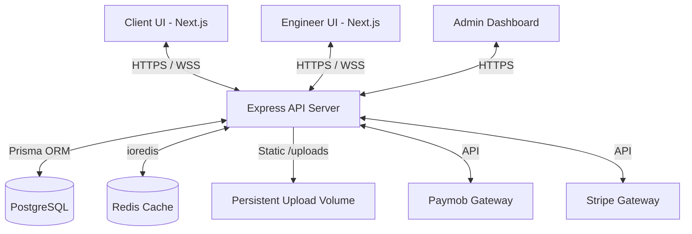

# 🏗️ CLINKA

CLINKA is a premium, escrow-secured freelance platform specifically designed to connect **Clients** (individuals or companies) with certified **Engineers** (specializing in Civil and Architectural engineering). The platform enables seamless project postings, bidding, real-time messaging, secure escrow payments, and deliverable submissions.

---

## 🚀 Tech Stack

CLINKA is built using a modern, robust, and highly scalable stack designed to support real-time interactions and secure financial transactions:

| Layer | Technology | Purpose |
| :--- | :--- | :--- |
| **Frontend** | **Next.js 16 (App Router)** & **React 19** | Server-side rendering, routing, and modern UI. |
| **Styling** | **Tailwind CSS v4** | Highly custom, rapid utility-first styling. |
| **State Management** | **Zustand** | Lightweight, decoupled global client state. |
| **Backend API** | **Node.js** & **Express (TypeScript)** | Clean, modular REST API. |
| **Real-time Engine** | **Socket.IO** | Bi-directional messaging, typing indicators, and instant notifications. |
| **Database** | **PostgreSQL** | Relational data persistence. |
| **ORM** | **Prisma (v7)** | Type-safe database queries, schema management, and migrations. |
| **Caching / Store** | **Redis (ioredis)** | Session store, Google OAuth state caching, and disbursement tokens. |
| **File Storage** | **Local server storage** | Persistent `/uploads` directory, CDN-ready via `UPLOAD_BASE_URL`. |
| **Payments** | **Stripe** & **Paymob** | Escrow payments (Stripe/Paymob) and local wallet payouts (Paymob disbursements). |
| **Validation** | **Zod** | End-to-end schema validation on both client and server. |
| **Mailing** | **Nodemailer** | Custom transactional HTML emails (verification, alerts, password resets). |

---

## 🎯 What the Application Does (Core Flows)

CLINKA operates as an **Escrow-based Engineering Marketplace**. The platform centers around three primary user roles:

### 1. User Roles

*   **Client (Individuals / Companies):**
    *   Publishes engineering projects with detailed descriptions, budget ranges, and service types (Design, Supervision, or Review).
    *   Receives and compares bids submitted by verified engineers.
    *   Accepts bids, funds the project escrow securely, and reviews submitted deliverables.
    *   Releases funds upon successful completion, requests revisions, or leaves rating reviews.
*   **Engineer (Civil & Architectural Specialists):**
    *   Applies for a professional account by uploading credentials (College ID, University Certificate, Syndicate Card).
    *   Builds a professional profile showcasing specialized experience, reviews, and a project portfolio.
    *   Submits competitive bids on active projects (including price, duration, and proposal description).
    *   Receives escrow funding assurance before starting work, submits project deliverables directly through the platform, and requests withdrawals to their digital wallets.
*   **Admin (Platform Operations):**
    *   Approves or rejects engineer applications based on uploaded documents.
    *   Monitors platform activity, flags suspicious projects/users, and bans bad actors (e.g., users sharing contact information).
    *   Manages platform commission fees (default 10%), reviews support tickets, and approves digital wallet withdrawals.

---

## 🛠️ System Architecture



### 1. Escrow & Wallet System
To ensure safety for both parties, CLINKA utilizes a robust **Escrow Workflow**:
1. **Funding:** When a client accepts a bid, the money is charged via Stripe or Paymob and held in the platform's escrow account (`PaymentStatus: FUNDED`).
2. **Execution:** The engineer receives an automated notification to begin execution.
3. **Submission:** The engineer uploads project deliverables.
4. **Approval:** The client approves the deliverables, triggering the escrow release.
5. **Payout:** The funds are transferred to the engineer's digital wallet (`PaymentStatus: RELEASED`) minus the platform's 10% commission. The engineer can request a payout via Paymob disbursement.

### 2. Real-Time Chat & Collaboration
*   An active chat room is automatically created between the Client and Engineer once a bid is accepted.
*   Powered by **Socket.IO** to support instant message delivery, file attachments, and active typing statuses.
*   An automated monitoring filter flags contact information sharing to prevent disintermediation.

### 3. Verification & Trust
*   Engineers must pass document validation before they can bid or stand out with a `Verified` badge.
*   A transparent **Reviews & Ratings (1-5 stars)** system ensures service quality.

---

## 💻 Directory Structure

```bash
├── backend
│   ├── src
│   │   ├── config          # Application settings & environment loaders
│   │   ├── generated       # Auto-generated Prisma client
│   │   ├── middlewares      # Auth guards, validation, error handling, ban checks
│   │   ├── modules          # Core domain logic (auth, bids, messages, payments, etc.)
│   │   ├── routes           # Main API endpoint definitions
│   │   ├── socket.ts        # Real-time WebSocket connection handling
│   │   └── server.ts        # Server entry point
│   ├── prisma               # Database schema definitions & migrations
│   └── package.json
│
├── frontend
│   ├── app                  # Next.js App Router (pages & layouts)
│   ├── components           # Shared UI components
│   ├── features             # Decoupled feature-based logic (marketing, admin, messages)
│   ├── lib                  # Shared utilities, validation schemas, Zustand stores
│   └── package.json
```

---

## ⚡ Quick Start for Development

### 1. Prerequisites
Ensure you have **Node.js (>=20)** and **Docker** installed.

### 2. Install Dependencies
At the project root:
```bash
npm install
```

### 3. Setup Environment Variables
*   Create a `backend/.env` file from `backend/.env.example`
*   Create a `frontend/.env.local` file from `frontend/.env.example`

### 4. Run the Database & Migrations
```bash
cd backend
npm run db:setup
```

### 5. Launch the Application
At the project root, run the concurrent dev server (launches both frontend on port `3000` and backend on port `5000`):
```bash
npm run dev
```

---

## 🌐 Deployment Configuration

Refer to [DEPLOY.md](file:///home/mohamedtalal/Documents/CLINKA/DEPLOY.md) for full production deployment instructions on Vercel (Frontend), Coolify/Dokploy (Backend & WebSocket), PostgreSQL, persistent upload storage, and third-party setups (Google OAuth, Paymob).
